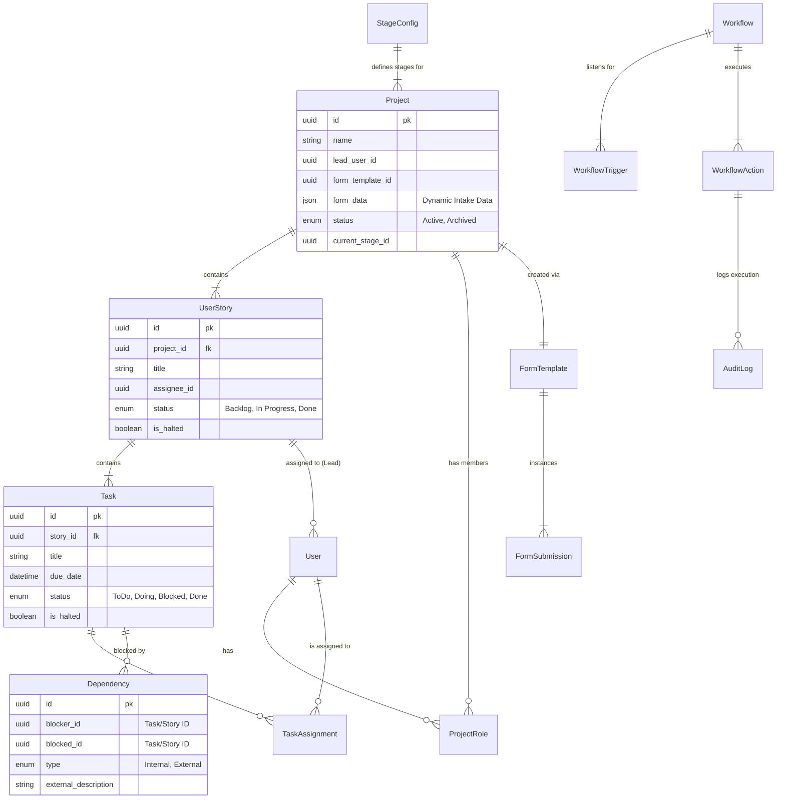
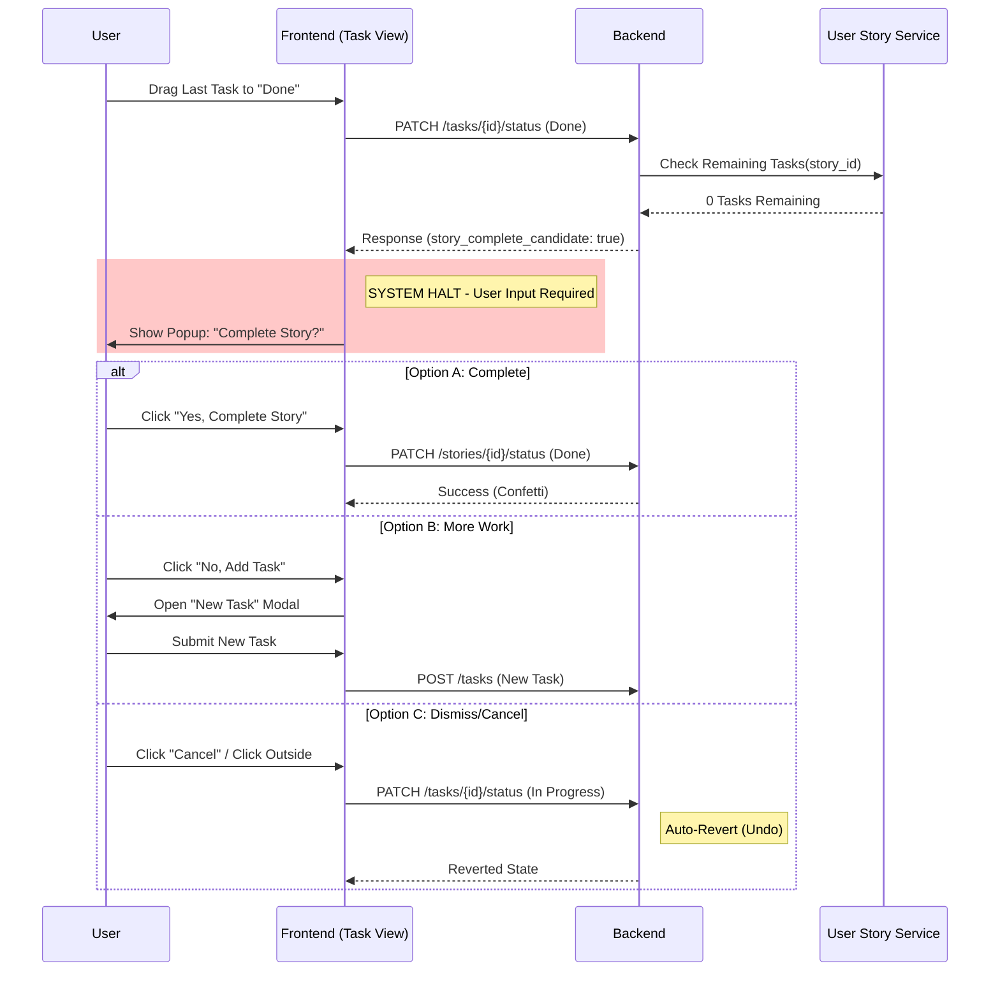
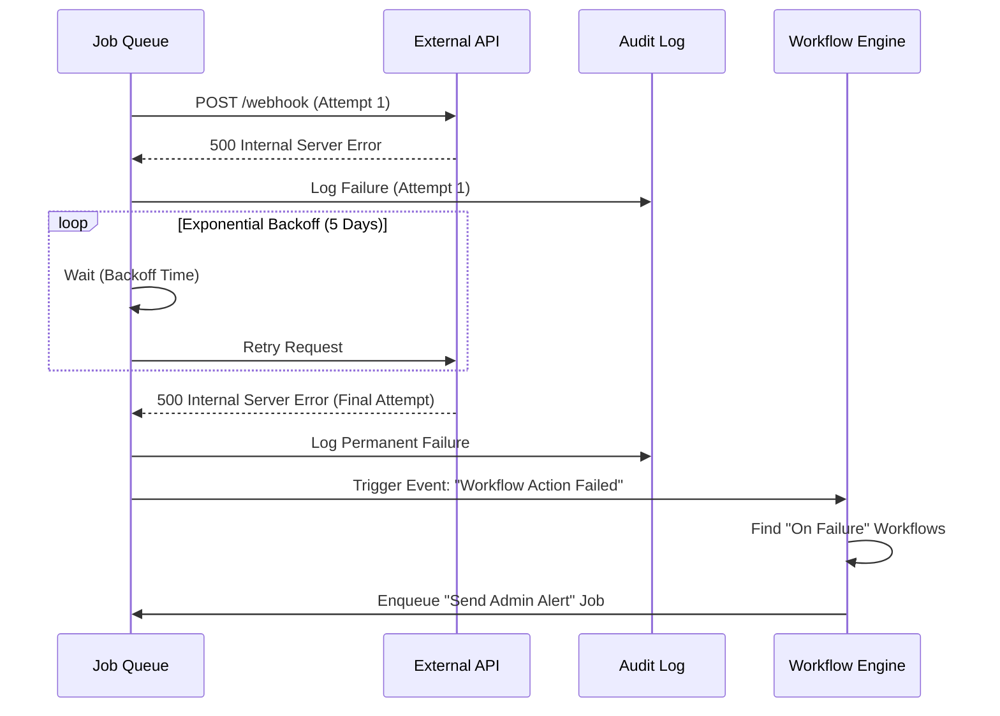

# NexusFlow Automation Engine: Handover Package

**Version:** 1.0.0
**Reference:** PRD v1.5.0
**Target Audience:** System Architect, Database Engineer, Frontend Lead

---

## 1. Data Architecture (ERD)

The following Entity Relationship Diagram defines the core schema required to support the `Project -> User Story -> Task` hierarchy, Multi-Form Intake system, and Automation Engine.



---

## 2. API Specification (Automation Engine)

### 2.1 Reusable Action Schema
The "Action" object is stored in the database and referenced by workflows.

```json
{
  "action_id": "act_550e8400",
  "name": "Send Slack Notification",
  "method": "POST",
  "url": "https://hooks.slack.com/services/...",
  "headers": {
    "Content-Type": "application/json",
    "Authorization": "Bearer {{secret_token}}" // Preserved as plain text per MVP
  },
  "body_template": {
    "text": "Task {{task.name}} was assigned to {{task.assignee.name}}."
  },
  "retry_policy": {
    "enabled": true,
    "strategy": "exponential_backoff",
    "max_days": 5
  }
}
```

### 2.2 Webhook Payload (Outgoing)
When a trigger fires, the system constructs this payload.

```json
{
  "event": "project.claimed",
  "timestamp": "2026-10-15T08:00:00Z",
  "source": {
    "id": "proj_123",
    "type": "project"
  },
  "context": {
    "project": {
      "name": "Q3 Marketing",
      "lead": "Alice Smith",
      "form_version": "v1.2"
    },
    "actor": {
      "id": "user_999",
      "email": "alice@company.com"
    }
  }
}
```

---

## 3. Logic Sequence Diagrams

### 3.1 Critical Path: User Story Completion
**Scenario:** A Team Member completes the *last* task in a User Story.



### 3.2 Resilience: Workflow Failure & Retry
**Scenario:** A configured webhook fails (500 Error).



---

## 4. UX Implementation Specs

### 4.1 Dependency "HALTED" State
*   **Kanban Card:**
    *   **Border:** 2px Solid Red (#FF0000).
    *   **Overlay:** "HALTED" badge in top-right.
    *   **Interaction:** Drag-and-drop DISABLED.
    *   **Tooltip:** Hover shows "Blocked by: [Task Name] (Assigned to: [User])".
*   **Gantt Bar:**
    *   **Color:** Striped Red/Grey pattern.
    *   **Line:** Solid Red line to dependency.

### 4.2 Array Iterator UI (Workflow Builder)
*   **Constraint:** When a user selects a variable that is an Array (e.g., `{{task.assignees}}`), the UI **MUST** disable the "Insert Variable" button and instead show two options:
    1.  **[Iterate]:** "Run this action for each item."
    2.  **[Join]:** "Join values with 'Comma'."
*   **Purpose:** Prevents sending `[Object object]` in JSON payloads.
