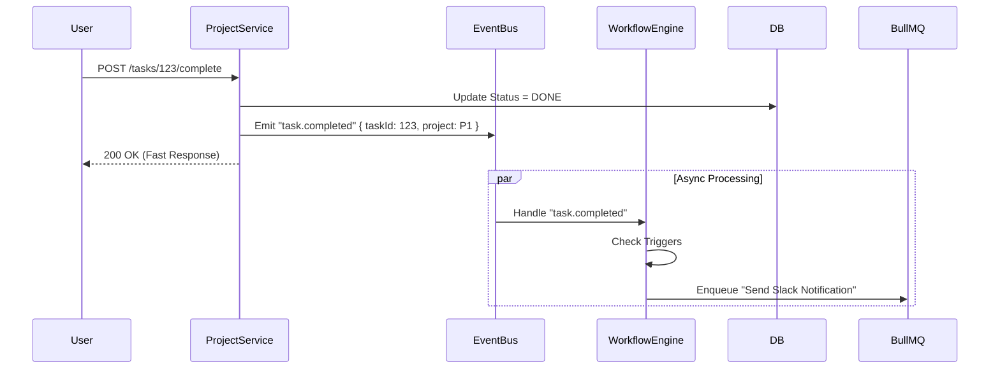

# 02. Backend Architecture: The Modular Monolith

**Role:** Senior Systems Architect
**Status:** DRAFT
**Stack:** NestJS + Supabase (Postgres) + BullMQ

This document defines the backend structure, enforcing strict isolation between "Core Business Logic" (Projects) and the "Automation Brain" (Workflows).

---

## 1. High-Level Concept
The backend is a **Modular Monolith**.
*   **Deployment:** Single Docker container.
*   **Code Structure:** Distinct `libs/` or `modules/` that *cannot* import each other's services directly.
*   **Communication:**
    *   **Synchronous (Read):** Allowed only via public "Facades" or shared Types.
    *   **Asynchronous (Write/Side-Effects):** STRICTLY via Domain Events (e.g., `ProjectCreatedEvent`).

---

## 2. Module Decomposition

### 2.1 `IAM Module` (Identity & Access)
**Responsibility:** Guards, Roles, and User Context.
*   **Integration:** Wraps **Supabase Auth**.
*   **Exports:** `AuthGuard`, `GetUser()` decorator, `RolesGuard`.
*   **Data:** No dedicated tables (uses Supabase `auth.users` + local `public.users` sync if needed).

### 2.2 `Project Core Module` (The Source of Truth)
**Responsibility:** CRUD for Projects, Stories, Tasks,Forms.
*   **Data Models:** `Project`, `Story`, `Task`, `Comment`.
*   **Key Logic:**
    *   "Halted" State Calculation (Dependency Tree traversal).
    *   Form Submission Validation.
*   **Events Emitted:**
    *   `project.created`
    *   `task.status_changed`
    *   `dependency.resolved`

### 2.3 `Workflow Engine Module` (The Brain)
**Responsibility:** Listening to events and executing automation rules.
*   **Isolation:** strictly **DECOUPLED** from Project Core. It knows "Task Status Changed" happened, but doesn't know *why*.
*   **Components:**
    *   **Rule Evaluator:** Matches event -> Trigger Config.
    *   **Action Executor:** Runs the API calls (Slack, Jira, Email).
    *   **Retry Manager:** Interfaces with **BullMQ** for the 5-day backoff.

---

## 3. The Event Bus Pattern (Crucial)

To prevent "Spaghetti Code" where Project Serviice calls Email Service directly:



**Implementation in NestJS:**
*   Use `@nestjs/event-emitter`.
*   **Rule:** `ProjectService` must NEVER import `WorkflowService`.

---

## 4. API Strategy (Contract-First)

### 4.1 REST Controllers (Standard)
*   **Validation:** `Zod` DTOs.
*   **Docs:** Swagger (`@nestjs/swagger`) auto-generated.
*   **Versioning:** URI Versioning (`/api/v1/...`).

### 4.2 Webhook Ingestion
*   **Endpoint:** `POST /api/v1/webhooks/ingest/:source`
*   **Security:** HMAC Signature verification (Middleware).
*   **Behavior:** Immediately push to **Redis Queue**. Do NOT process synchronously.

---

## 5. Failure & Resilience (Simulating Microservices)

### 5.1 The "Outbox" Pattern (Optional for MVP, Recommended)
To ensure events aren't lost if Redis is down:
1.  Transaction: Update Task Status + Insert "Event" into `outbox` table.
2.  Background Job: Read `outbox` -> Publish to Event Bus.

*For MVP, we will stick to direct Event Emission, but structure the code to swap to Outbox later.*

---

## 6. Directory Structure (NestJS)

```
src/
├── common/             # Shared DTOs, Guards, Filters
├── modules/
│   ├── iam/            # Auth Wrappers
│   ├── project/        # Projects, Stories, Forms
│   │   ├── controllers/
│   │   ├── services/
│   │   └── project.module.ts
│   ├── workflow/       # The Automation Engine
│   │   ├── engine/     # Rule Matcher
│   │   ├── executor/   # Action Runners
│   │   └── workflow.module.ts
│   └── notification/   # Email/Slack helpers
├── database/           # Prisma Client & Seeds
└── main.ts
```

---

## Action Item
Please review the Backend Architecture.
**Key Focus:** Do you agree with the **Event Bus** strict separation? This is what makes it "Microservice Ready".
